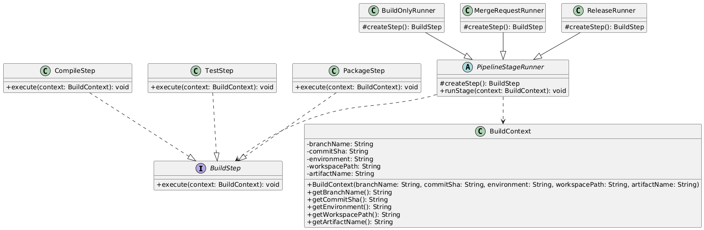
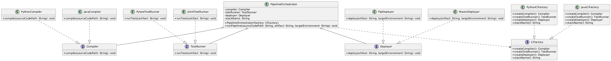

# Assignment 2 - Factory Method & Abstract Factory

## Theme

My theme is CI/CD Toolchain.


## Domain

The application manages the build pipeline. 
A pipeline consists of 3 stages, during which the source code is compiled, tested and deployed as an artifact.
Part A provides a single step of a build stage.
Part B introduces an entire set of tools for a particular tech stack.

## Repository structure

```
.
└─── app
    ├── build.gradle
    └── src
        └── main
            └── java
                ├── abstractfactory
                │   ├── Main.java
                │   ├── PipelineOrchestrator.java
                │   ├── stack
                │   │   ├── CiFactory.java
                │   │   ├── java
                │   │   │   ├── JavaCiFactory.java
                │   │   │   ├── JavaCompiler.java
                │   │   │   ├── JUnitTestRunner.java
                │   │   │   └── MavenDeployer.java
                │   │   └── python
                │   │       ├── PipDeployer.java
                │   │       ├── PytestTestRunner.java
                │   │       ├── PythonCiFactory.java
                │   │       └── PythonCompiler.java
                │   └── toolchain
                │       ├── Compiler.java
                │       ├── Deployer.java
                │       └── TestRunner.java
                └── factorymethod
                    ├── BuildContext.java
                    ├── Main.java
                    ├── runner
                    │   ├── BuildOnlyRunner.java
                    │   ├── MergeRequestRunner.java
                    │   ├── PipelineStageRunner.java
                    │   └── ReleaseRunner.java
                    └── step
                        ├── BuildStep.java
                        ├── CompileStep.java
                        ├── PackageStep.java
                        └── TestStep.java
```

## Part A - Factory Method

The product is a build step.

- **Product** - BuildStep
- **ConcreteProduct** - CompileStep, TestStep, PackageStep
- **Creator** - PipelineStageRunner
- **ConcreteCreator** - BuildOnlyRunner, MergeRequestRunner, ReleaseRunner

Pipeline stage runner class PipelineStageRunner contains the factory method createStep() and the business method runStage(). Each of its subclasses returns a different step. The runStage() method uses the product only via the BuildStep interface. The client code never calls new CompileStep().

### Pattern's UML Diagram


## Part B - Abstract Factory

The family is a toolchain for one tech stack.

- **AbstractProduct** - `Compiler`, `Deployer`, `TestRunner`
- **AbstractFactory** - `CiFactory`
- **ConcreteFactory** - `JavaCiFactory`, `PythonCiFactory`
- **Client** - `PipelineOrchestrator`

The Java family uses javac to make a .jar file. They test with JUnit, and deploy with mvn deploy to Nexus. 
The Python family uses mypy + bytecode to make a .whl file, tested with pytest, and deployed with twine to PyPI. 
Tools from different stacks don't fit with each other - the artifact format is different, and JUnit can't test a whl file. PipelineOrchestrator gets the factory in its constructor. It's composition, and it stores the products as interface fields. There's no new statements within it. No if's about the stack within it. The family is chosen in one place only, namely abstractfactory.Main.

### Pattern's UML Diagram


## Why Part B is not just three Factory Methods

Three distinct factory methods have been applied to let the user combine the stacks. They can be used in any combination, such as JavaCompiler and PytestTestRunner. In this example, all three objects are created using a single CiFactory instance. Incorrect combinations are not allowed since the whole stack is rebuilt on a single constructor parameter. 

The Factory Method pattern uses inheritance to implement the createStep(), while Abstract Factory uses composition and the factory is created externally.

## SOLID

OCP - A new stack needs a new factory and one line in `Main`. `PipelineOrchestrator` does not change. 
SRP - the factory knows what the stack is composed of. The orchestrator knows the order of the calls. 
DIP - the clients depend on interfaces, not on the concrete classes.

## Drawback

A new variant of a product is costly. For example, a `Linter`. Then `CiFactory` changes. Every concrete factory changes too. The pattern is open for new families. It is closed for new kinds of products.

Only with one stack this pattern would be too much.

## How to run

Requirements: JDK 17 or newer.

```bash
./gradlew runFactoryMethod
./gradlew runAbstractFactory
```
